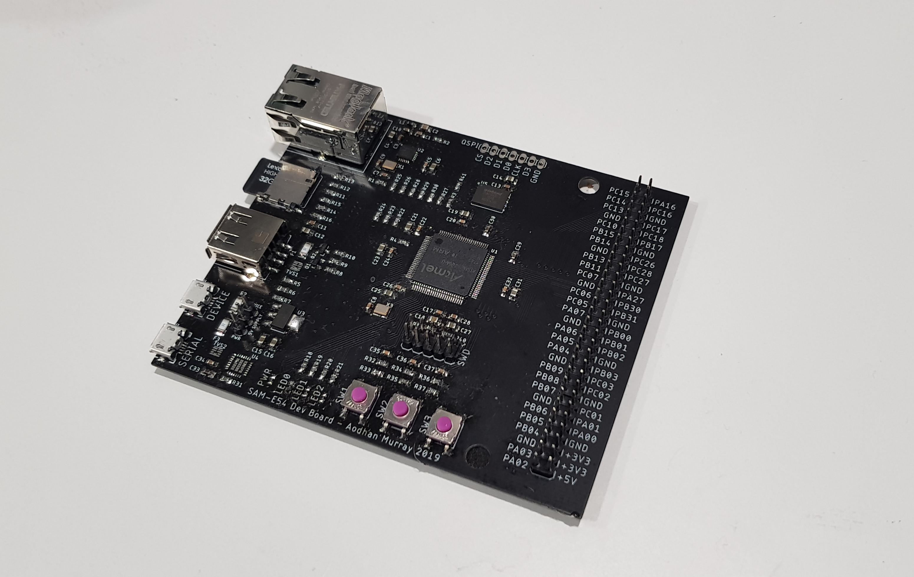
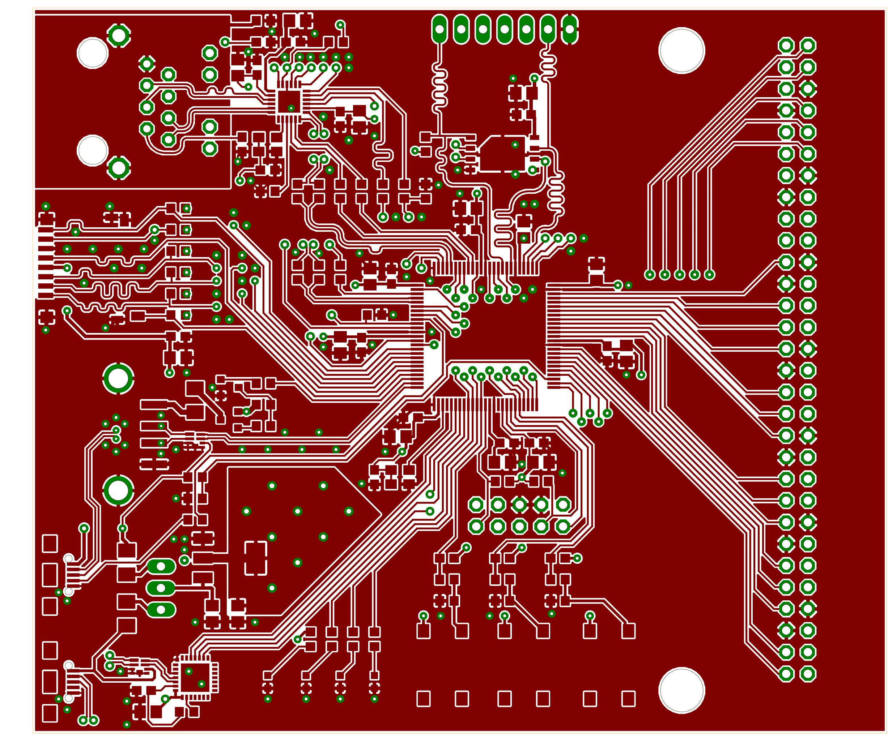
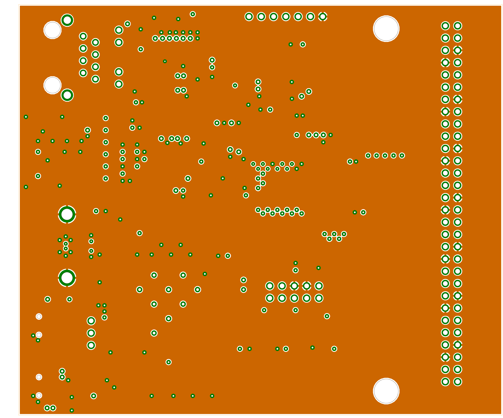
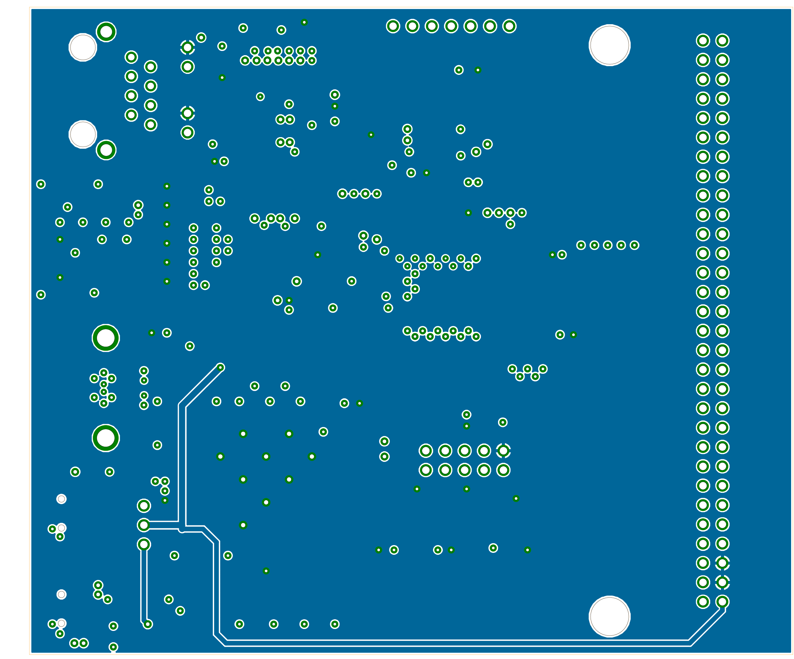
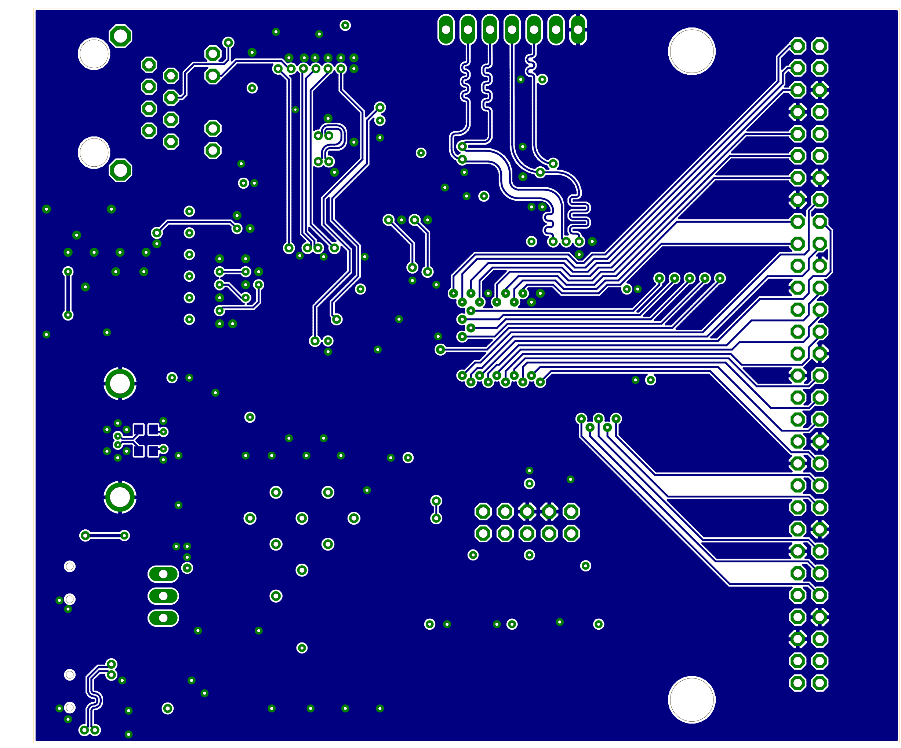

# SAM-E54 Development Board
### Summary 
Development Board based around the Atmel SAME54 MCU exposing peripherals such as USB Host/Device, USB Serial, 100BASE-T Ethernet, SDHC and a QSPI with 1Gb flash.
### Features
- USB Host / Device
- USB Serial (CP2102) 
- SDHC Interface
- 100BASE-T Ethernet (KSZ8091RNA PHY)
- QSPI with W25N01GV footprint (1Gb flash)
- Cortex M ISP header
- 4 Indicator LEDs
- 3 Push Button switches
- 43 Pins accessible through 60 pin header

## Finished Board

## PCB Stackup
| Layer | Material | Thickness |
|:-----:|:--------:|:---------:|
| 1 | Copper | 0.035mm |
|  | Prepreg | 0.2mm |
| 2 | Copper | 0.0175mm |
|  | Core | 0.265mm |
| 3 | Copper | 0.0175mm |
|  | Prepreg | 0.2mm |
| 4 | Copper | 0.035mm |

## Copper Layers
| Layer 1 | Layer 2 |
|:----:|:----:|
||  |

| Layer 3 | Layer 4 |
|:----:|:----:|
||  |